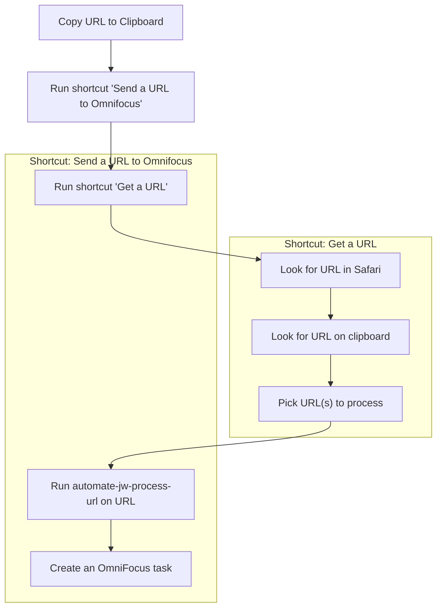

<!-- vim: set wrap linebreak breakat&vim: -->
# automate-jw docs

This project is an attempt to automate processing my inboxes. I spend about an hour each workday clearing my email inboxes, catching up on Slack, and reading GitHub activity. I'd like to automate some of this, so that I don't feel I have to monitor my inboxes so closely. Some things I'd like to do:

* Create an OmniFocus task when someone requests a GitHub review
* Create an OmniFocus task when someone assigns me a Jira task

## Shortcuts

* [Get a URL](./shortcuts/get-a-url.md)
* [Send URL to Omnifocus](./shortcuts/send-url-to-omnifocus.md)

## Current Workflow

<!-- Local debugging of Mermaid -->
<!--

-->

